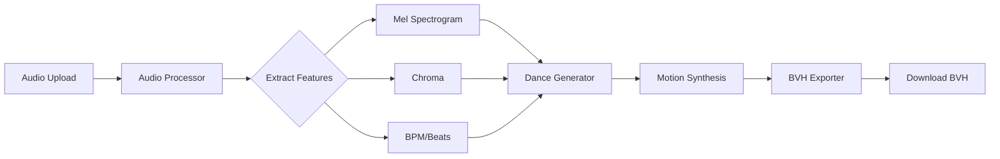

# AI Dance Choreography System - MVP

> 🎭 Transform music into synchronized dance animations using AI


## Overview

This system generates synchronized dance choreography for animated characters from audio input. It uses a simplified version of the MINT/FACT (Full Attention Cross-modal Transformer) model to create 3D motion sequences that align with musical beats and rhythm.

**Key Features:**
- 🎵 Upload MP3/WAV audio files (up to 30 seconds)
- 💃 AI-generated dance choreography synchronized to music
- 📊 BVH format export for use in Blender, Unity, Maya, etc.
- 🌐 Modern web interface with drag-and-drop
- 💻 CPU-optimized for 8GB RAM systems (no GPU required)
- ⚡ Baseline procedural motion generator for MVP

## System Requirements

- **OS**: Windows, macOS, or Linux
- **RAM**: 8GB minimum
- **Python**: 3.9, 3.10, 3.11, or 3.12 (any version works)
- **Browser**: Chrome, Firefox, or Edge (latest version)
- **No GPU required** - fully CPU-compatible
- **No TensorFlow needed** for MVP (only required if upgrading to full MINT model)

## Installation

### 1. Clone or Download

```bash
cd "d:\Dance model"
```

### 2. Create Virtual Environment

```bash
python -m venv venv

# Windows
venv\Scripts\activate

# macOS/Linux
source venv/bin/activate
```

### 3. Install Dependencies

```bash
pip install -r requirements.txt
```

**Note**: Installation may take 2-5 minutes to download audio processing libraries.

### 4. Verify Installation

```bash
python -c "import librosa; import flask; import numpy; print('✅ All dependencies installed!')"
```

## Running the System

### Start the Backend Server

```bash
python app.py
```

You should see:
```
🎭 AI Dance Choreography System - MVP
====================================
Mode: CPU-only (8GB RAM optimized)
🚀 Starting Flask server...
📡 URL: http://localhost:5000
```

### Access the Web Interface

Open your browser and navigate to:
```
http://localhost:5000
```

## Usage Guide

### 1. **Upload Audio**
   - Click the upload zone or drag-and-drop an audio file
   - Supported formats: MP3, WAV, OGG
   - Maximum duration: 30 seconds
   - Maximum file size: 10MB

### 2. **Select Dance Style** (Optional)
   - Choose from: Auto, Hip-Hop, Pop, Jazz, Ballet, House
   - The baseline model will adjust motion intensity based on style

### 3. **Generate Dance**
   - Click "Generate Choreography"
   - Wait 1-3 minutes (depends on audio length and CPU speed)
   - Progress bar shows: Feature extraction → Generation → Export

### 4. **Download BVH**
   - Click "Download BVH File"
   - Import into your 3D software (see below)

## Using Generated Animations

### Import into Blender

1. Open Blender
2. File → Import → Motion Capture (.bvh)
3. Select your downloaded BVH file
4. The skeleton will appear with animation
5. Attach to your character using retargeting

**Blender Retargeting:**
- Use NLA (Non-Linear Animation) Editor
- Or use the "Rokoko" addon for automatic retargeting

### Import into Unity

1. Drag BVH file into Assets folder
2. Select the file in Inspector
3. Set Animation Type: "Humanoid"
4. Configure Avatar
5. Apply to any character with Humanoid rig

### Import into Maya/MotionBuilder

- File → Import → BVH
- Standard skeletal animation import

## Project Structure

```
d:\Dance model\
├── app.py                # Flask backend server
├── audio_processor.py    # Audio feature extraction (librosa)
├── generator.py          # Dance generation (baseline model)
├── bvh_export.py         # BVH file writer
├── requirements.txt      # Python dependencies
├── static/
│   ├── index.html        # Web interface
│   ├── style.css         # Modern dark theme UI
│   └── app.js            # Frontend JavaScript
├── uploads/              # Uploaded audio files
├── outputs/              # Generated BVH files
├── models/               # Model checkpoints (future)
└── README.md             # This file
```

## Architecture



### Data Flow

1. **Audio Upload**: User uploads MP3/WAV via web interface
2. **Feature Extraction**: Librosa extracts mel spectrograms, chroma features, tempo, and beat locations
3. **Motion Generation**: Baseline generator creates procedural dance motion synchronized to beats
4. **Export**: Motion data converted to BVH format (24-joint SMPL skeleton)
5. **Download**: User downloads BVH for import into 3D software

## MVP Limitations & Future Improvements

### Current MVP (Baseline Model)
- ✅ CPU-only, works on 8GB RAM
- ✅ Procedural motion generation
- ✅ Beat-synchronized movement
- ✅ BVH export compatible with all major 3D software
- ⚠️ Simple procedural animations (not ML-generated)
- ⚠️ Limited style variation
- ⚠️ Max 30-second audio clips

### Future Enhancements
- 🔮 Full MINT/FACT model integration with pre-trained checkpoint
- 🔮 GPU acceleration option
- 🔮 Longer audio support (2-3 minutes)
- 🔮 Style-specific motion models
- 🔮 Real-time 3D preview in web browser
- 🔮 FBX export option
- 🔮 Multiple character variations

## Troubleshooting

### Server won't start
```bash
# Check Python version
python --version  # Should be 3.9+

# Reinstall dependencies
pip install -r requirements.txt --force-reinstall
```

### "Cannot connect to server" error
- Make sure Flask is running (`python app.py`)
- Check that port 5000 is not used by another program
- Try accessing `http://127.0.0.1:5000` instead

### Upload fails
- Check file size (max 10MB)
- Check file format (MP3, WAV, OGG only)
- Check file duration (max 30 seconds)

### Generation takes very long
- Normal for CPU: 1-3 minutes for 15-30 second audio
- Close other applications to free up CPU
- Try shorter audio clips

### BVH import issues in Blender/Unity
- Make sure to select "Motion Capture" or "BVH" import type
- Set FPS to 60 in import settings
- Check that skeleton is in T-pose initially

## Technical Details

### Audio Features
- **Sample Rate**: 48kHz
- **Mel Spectrogram**: 128 bands, 8kHz max frequency
- **Chroma**: 12-bin pitch class profile
- **Tempo Detection**: Librosa beat tracker
- **Frame Rate**: 60 FPS (synchronized with motion)

### Motion Format
- **Skeleton**: 24-joint SMPL humanoid
- **Rotation Format**: Euler angles (degrees)
- **Translation**: Root joint XYZ position
- **Frame Rate**: 60 FPS
- **Export Format**: BVH (Biovision Hierarchy)

### SMPL Skeleton Hierarchy
```
Pelvis (root)
├─ L_Hip → L_Knee → L_Ankle → L_Foot
├─ R_Hip → R_Knee → R_Ankle → R_Foot
└─ Spine1 → Spine2 → Spine3
    ├─ Neck → Head
    ├─ L_Collar → L_Shoulder → L_Elbow → L_Wrist → L_Hand
    └─ R_Collar → R_Shoulder → R_Elbow → R_Wrist → R_Hand
```

## API Reference

### Health Check
```
GET /api/health
Response: {"status": "ok", "mode": "cpu"}
```

### Upload Audio
```
POST /api/upload
Body: FormData with 'audio' file
Response: {
  "success": true,
  "filename": "uploaded_file.mp3",
  "duration": 25.5,
  "bpm": 120.0
}
```

### Generate Dance
```
POST /api/generate
Body: {"filename": "uploaded_file.mp3", "style": "hip-hop"}
Response: {
  "success": true,
  "output_filename": "dance.bvh",
  "num_frames": 1530,
  "duration": 25.5,
  "generation_time": 127.3
}
```

### Download BVH
```
GET /api/download/<filename>
Response: BVH file download
```

## References

### Papers & Research
- **AI Choreographer (ICCV 2021)**: [arxiv.org/abs/2101.08779](https://arxiv.org/abs/2101.08779)
- **AIST++ Dataset**: [google.github.io/aistplusplus_dataset](https://google.github.io/aistplusplus_dataset/)

### Code & Models
- **MINT/FACT Model**: [github.com/google-research/mint](https://github.com/google-research/mint)
- **AIST++ API**: [github.com/google/aistplusplus_api](https://github.com/google/aistplusplus_api)

### Tools & Libraries
- **Librosa** (Audio Processing): [librosa.org](https://librosa.org/)
- **TensorFlow** (ML Framework): [tensorflow.org](https://www.tensorflow.org/)
- **Flask** (Web Framework): [flask.palletsprojects.com](https://flask.palletsprojects.com/)

## License

This is an educational MVP implementation. For production use:
- MINT/FACT model: Apache 2.0 License (Google Research)
- AIST++ Dataset: Non-commercial research use only
- This codebase: MIT License (unless using AIST++ data)

## Contributing

This is an MVP implementation. Future improvements welcome:
- Full MINT model integration
- Additional export formats (FBX, GLTF)
- Web-based 3D viewer
- Dance style transfer
- Multi-person choreography

## Support

For issues or questions:
1. Check this README first
2. Review the Troubleshooting section
3. Check server logs in console
4. Check browser console (F12) for frontend errors

## Acknowledgments

- Google Research for the MINT/FACT model and AIST++ dataset
- Librosa team for audio processing library
- Open-source motion capture community

---

**Built with ❤️  • MVP v1.0**

